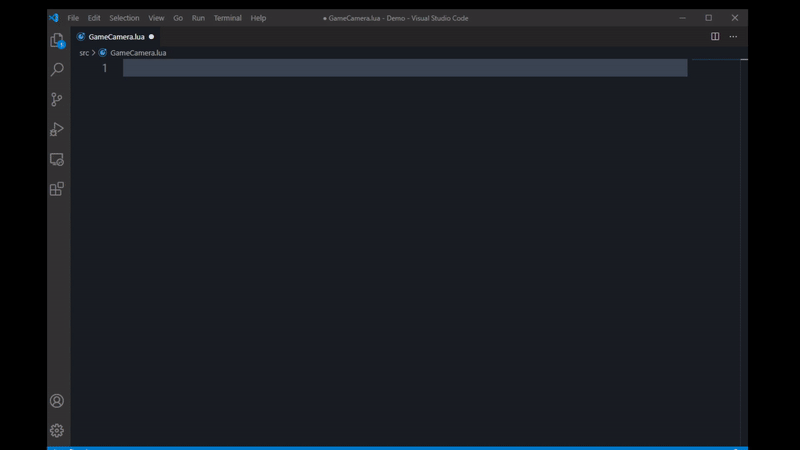

# VS Code Snippets

Being able to quickly create services, controllers, or other Knit-related items is very useful when using Knit as a framework. To keep Knit lightweight, there are no required extensions or plugins. Instead, below are some VS Code snippets that can be used to speed up development.



## Using Snippets
Snippets are a Visual Studio Code feature. Check out the [Snippets documentation](https://code.visualstudio.com/docs/editor/userdefinedsnippets) for more info. Adding Snippets for Lua is very easy.

1. Within Visual Studio, navigate from the toolbar: `File -> Preferences -> User Snippets`
1. Type in and select `lua.json`
1. Within the `{}` braces, include any or all of the snippets below
1. Save the file
1. Within your actual source files, start typing a prefix (e.g. "knit") and select the autocompleted snippet to paste it in
1. Depending on the snippet, parts of the pasted code will be selected and can be typed over (e.g. setting the name of a service)

-------------------------------------

## Knit Snippets

Below are useful VS Code snippets for Knit. The snippets assume that the Knit module has been placed within ReplicatedStorage.

### Knit
Include a `require` statement for Knit.
<details class="note">
<summary>Snippet</summary>

```json
"Knit": {
	"prefix": ["knit"],
	"body": ["local Knit = require(game:GetService(\"ReplicatedStorage\").Packages.Knit)"],
	"description": "Require the Knit module"
}
```

</details>
<details class="success">
<summary>Code Result</summary>

```lua
local Knit = require(game:GetService("ReplicatedStorage").Packages.Knit)
```

</details>

-------------------------------------

### Service
Reference a Roblox service.

<details class="note">
<summary>Snippet</summary>

```json
"Service": {
	"prefix": ["service"],
	"body": ["local ${0:Name}Service = game:GetService(\"${0:Name}Service\")"],
	"description": "Roblox Service"
}
```
</details>
<details class="success">
<summary>Code Result</summary>

```lua
local HttpService = game:GetService("HttpService")
```

</details>

-------------------------------------

### Knit Service
Reference Knit, create a service, and return the service.
<details class="note">
<summary>Snippet</summary>

```json
"Knit Service": {
	"prefix": ["knitservice"],
	"body": [
		"local Knit = require(game:GetService(\"ReplicatedStorage\").Packages.Knit)",
		"",
		"local ${0:$TM_FILENAME_BASE} = Knit.CreateService {",
		"\tName = \"${0:$TM_FILENAME_BASE}\";",
		"\tClient = {};",
		"}",
		"",
		"",
		"function ${0:$TM_FILENAME_BASE}:KnitStart()",
		"\t",
		"end",
		"",
		"",
		"function ${0:$TM_FILENAME_BASE}:KnitInit()",
		"\t",
		"end",
		"",
		"",
		"return ${0:$TM_FILENAME_BASE}"
	],
	"description": "Knit Service template"
}
```

</details>
<details class="success">
<summary>Code Result</summary>

```lua
local Knit = require(game:GetService("ReplicatedStorage").Packages.Knit)

local MyService = Knit.CreateService {
	Name = "MyService";
	Client = {};
}

function MyService:KnitStart()
end

function MyService:KnitInit()
end

return MyService
```

</details>

-------------------------------------

### Knit Controller
Reference Knit, create a controller, and return the controller.
<details class="note">
<summary>Snippet</summary>

```json
"Knit Controller": {
	"prefix": ["knitcontroller"],
	"body": [
		"local Knit = require(game:GetService(\"ReplicatedStorage\").Packages.Knit)",
		"",
		"local ${0:$TM_FILENAME_BASE} = Knit.CreateController { Name = \"${0:$TM_FILENAME_BASE}\" }",
		"",
		"",
		"function ${0:$TM_FILENAME_BASE}:KnitStart()",
		"\t",
		"end",
		"",
		"",
		"function ${0:$TM_FILENAME_BASE}:KnitInit()",
		"\t",
		"end",
		"",
		"",
		"return ${0:$TM_FILENAME_BASE}"
	],
	"description": "Knit Controller template"
}
```

</details>
<details class="success">
<summary>Code Result</summary>

```lua
local Knit = require(game:GetService("ReplicatedStorage").Packages.Knit)

local MyController = Knit.CreateController {
	Name = "MyController";
}

function MyController:KnitStart()
end

function MyController:KnitInit()
end

return MyController
```

</details>

-------------------------------------

### Knit Component
Create a Knit component.

<details class="note">
<summary>Snippet</summary>

```json
"Knit Component": {
	"prefix": ["knitcomponent"],
	"body": [
		"local Knit = require(game:GetService(\"ReplicatedStorage\").Packages.Knit)",
		"local Janitor = require(Knit.Util.Janitor)",
		"",
		"local ${0:$TM_FILENAME_BASE} = {}",
		"${0:$TM_FILENAME_BASE}.__index = ${0:$TM_FILENAME_BASE}",
		"",
		"${0:$TM_FILENAME_BASE}.Tag = \"${0:$TM_FILENAME_BASE}\"",
		"",
		"",
		"function ${0:$TM_FILENAME_BASE}.new(instance)",
		"\t",
		"\tlocal self = setmetatable({}, ${0:$TM_FILENAME_BASE})",
		"\t",
		"\tself._janitor = Janitor.new()",
		"\t",
		"\treturn self",
		"\t",
		"end",
		"",
		"",
		"function ${0:$TM_FILENAME_BASE}:Init()",
		"end",
		"",
		"",
		"function ${0:$TM_FILENAME_BASE}:Deinit()",
		"end",
		"",
		"",
		"function ${0:$TM_FILENAME_BASE}:Destroy()",
		"\tself._janitor:Destroy()",
		"end",
		"",
		"",
		"return ${0:$TM_FILENAME_BASE}"
	],
	"description": "Knit Component template"
}
```

</details>
<details class="success">
<summary>Code Result</summary>

```lua
local Knit = require(game:GetService("ReplicatedStorage").Packages.Knit)
local Janitor = require(Knit.Util.Janitor)

local MyComponent = {}
MyComponent.__index = MyComponent

MyComponent.Tag = "MyComponent"

function MyComponent.new(instance)
	local self = setmetatable({}, MyComponent)
	self._janitor = Janitor.new()
	return self
end

function MyComponent:Init()
end

function MyComponent:Deinit()
end

function MyComponent:Destroy()
	self._janitor:Destroy()
end

return MyComponent
```

</details>

-------------------------------------

### Knit Require
Require a module within Knit.
<details class="note">
<summary>Snippet</summary>

```json
"Knit Require": {
	"prefix": ["knitrequire"],
	"body": ["local ${1:Name} = require(Knit.${2:Util}.${1:Name})"],
	"description": "Knit Require template"
}
```

</details>
<details class="success">
<summary>Code Result</summary>

```lua
local Janitor = require(Knit.Util.Janitor)
```

</details>

-------------------------------------

### Lua Class
A standard Lua class.

<details class="note">
<summary>Snippet</summary>

```json
"Class": {
	"prefix": ["class"],
	"body": [
		"local ${0:$TM_FILENAME_BASE} = {}",
		"${0:$TM_FILENAME_BASE}.__index = ${0:$TM_FILENAME_BASE}",
		"",
		"",
		"function ${0:$TM_FILENAME_BASE}.new()",
		"\tlocal self = setmetatable({}, ${0:$TM_FILENAME_BASE})",
		"\treturn self",
		"end",
		"",
		"",
		"function ${0:$TM_FILENAME_BASE}:Destroy()",
		"\t",
		"end",
		"",
		"",
		"return ${0:$TM_FILENAME_BASE}"
	],
	"description": "Lua Class"
}
```

</details>
<details class="success">
<summary>Code Result</summary>

```lua
local MyClass = {}
MyClass.__index = MyClass

function MyClass.new()
	local self = setmetatable({}, MyClass)
	return self
end

function MyClass:Destroy()

end

return MyClass
```

</details>

-------------------------------------

### All
All the above snippets together.

<details class="note">
<summary>All Snippets</summary>

```json
{

	"Service": {
		"prefix": ["service"],
		"body": ["local ${0:Name}Service = game:GetService(\"${0:Name}Service\")"],
		"description": "Roblox Service"
	},

	"Class": {
		"prefix": ["class"],
		"body": [
			"local ${0:$TM_FILENAME_BASE} = {}",
			"${0:$TM_FILENAME_BASE}.__index = ${0:$TM_FILENAME_BASE}",
			"",
			"",
			"function ${0:$TM_FILENAME_BASE}.new()",
			"\tlocal self = setmetatable({}, ${0:$TM_FILENAME_BASE})",
			"\treturn self",
			"end",
			"",
			"",
			"function ${0:$TM_FILENAME_BASE}:Destroy()",
			"\t",
			"end",
			"",
			"",
			"return ${0:$TM_FILENAME_BASE}"
		],
		"description": "Lua Class"
	},

	"Knit": {
		"prefix": ["knit"],
		"body": ["local Knit = require(game:GetService(\"ReplicatedStorage\").Packages.Knit)"],
		"description": "Require the Knit module"
	},

	"Knit Component": {
		"prefix": ["knitcomponent"],
		"body": [
			"local Knit = require(game:GetService(\"ReplicatedStorage\").Packages.Knit)",
			"local Janitor = require(Knit.Util.Janitor)",
			"",
			"local ${0:$TM_FILENAME_BASE} = {}",
			"${0:$TM_FILENAME_BASE}.__index = ${0:$TM_FILENAME_BASE}",
			"",
			"${0:$TM_FILENAME_BASE}.Tag = \"${0:$TM_FILENAME_BASE}\"",
			"",
			"",
			"function ${0:$TM_FILENAME_BASE}.new(instance)",
			"\t",
			"\tlocal self = setmetatable({}, ${0:$TM_FILENAME_BASE})",
			"\t",
			"\tself._janitor = Janitor.new()",
			"\t",
			"\treturn self",
			"\t",
			"end",
			"",
			"",
			"function ${0:$TM_FILENAME_BASE}:Init()",
			"end",
			"",
			"",
			"function ${0:$TM_FILENAME_BASE}:Deinit()",
			"end",
			"",
			"",
			"function ${0:$TM_FILENAME_BASE}:Destroy()",
			"\tself._janitor:Destroy()",
			"end",
			"",
			"",
			"return ${0:$TM_FILENAME_BASE}"
		],
		"description": "Knit Component template"
	},

	"Knit Service": {
		"prefix": ["knitservice"],
		"body": [
			"local Knit = require(game:GetService(\"ReplicatedStorage\").Packages.Knit)",
			"",
			"local ${0:$TM_FILENAME_BASE} = Knit.CreateService {",
			"\tName = \"${0:$TM_FILENAME_BASE}\";",
			"\tClient = {};",
			"}",
			"",
			"",
			"function ${0:$TM_FILENAME_BASE}:KnitStart()",
			"\t",
			"end",
			"",
			"",
			"function ${0:$TM_FILENAME_BASE}:KnitInit()",
			"\t",
			"end",
			"",
			"",
			"return ${0:$TM_FILENAME_BASE}"
		],
		"description": "Knit Service template"
	},

	"Knit Controller": {
		"prefix": ["knitcontroller"],
		"body": [
			"local Knit = require(game:GetService(\"ReplicatedStorage\").Packages.Knit)",
			"",
			"local ${0:$TM_FILENAME_BASE} = Knit.CreateController { Name = \"${0:$TM_FILENAME_BASE}\" }",
			"",
			"",
			"function ${0:$TM_FILENAME_BASE}:KnitStart()",
			"\t",
			"end",
			"",
			"",
			"function ${0:$TM_FILENAME_BASE}:KnitInit()",
			"\t",
			"end",
			"",
			"",
			"return ${0:$TM_FILENAME_BASE}"
		],
		"description": "Knit Controller template"
	},

	"Knit Require": {
		"prefix": ["knitrequire"],
		"body": ["local ${1:Name} = require(Knit.${2:Util}.${1:Name})"],
		"description": "Knit Require template"
	}

}
```

</details>
